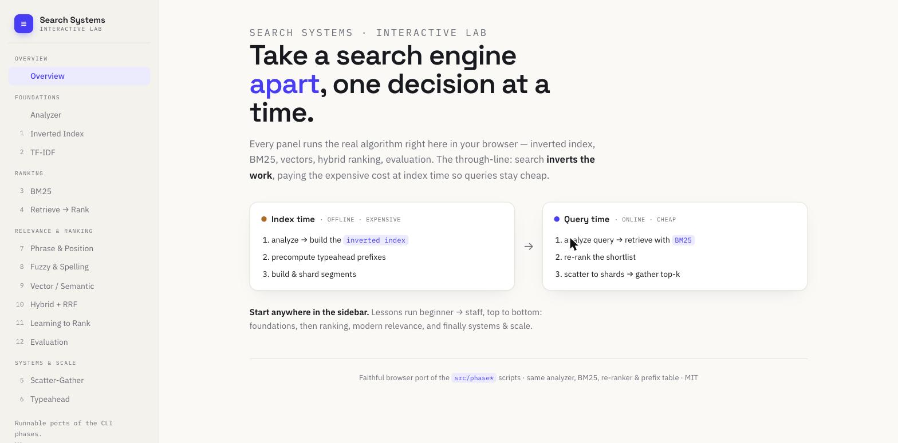
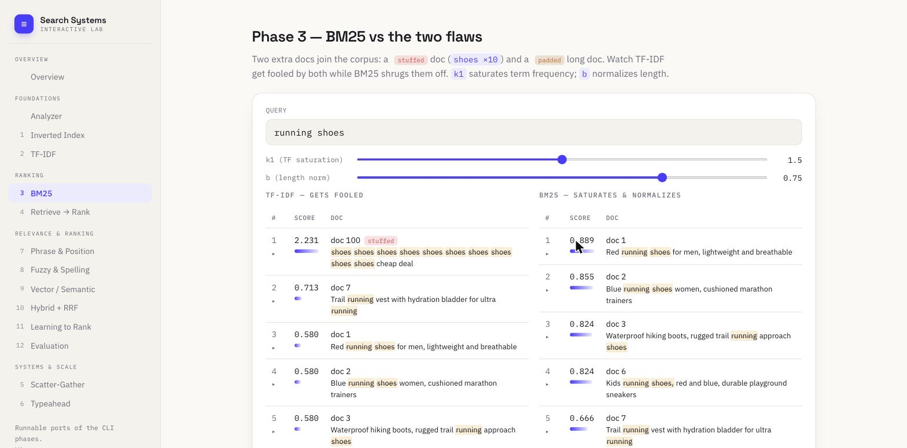

# Learn Search & Ranking in TypeScript

A hands-on, runnable path from **beginner to staff engineer** — the inverted index,
TF-IDF and BM25, retrieve-then-rank, phrases, fuzzy matching, vector/semantic search,
hybrid fusion, learning-to-rank, evaluation metrics, sharded scatter-gather, and typeahead.

Every phase is a small script you can run and read — **and** an interactive panel in the
web app (`npm run web`). No build step: modern Node runs the TypeScript directly. No
external services.



> Built to match a Staff-level study path. The through-line: search **inverts the
> work** — do the expensive part at INDEX time so query time is cheap. Every
> search question is four decisions: **analysis** (tokens/stemming),
> **retrieve-then-rank**, **freshness**, and **topology** (shard, scatter-gather).

## Setup

```bash
npm install   # dev types only
```

## The roadmap — beginner → staff

Each phase is a runnable script **and** an interactive panel in the web demo.
Work top to bottom; each tier assumes the one above.

**Tier 1 · Foundations** — how a query finds *any* matching document

| Command | What you learn |
|---|---|
| `npm run phase1` | **Inverted index** — analysis (tokenize/stopwords/stem) + boolean AND query |
| `npm run phase2` | **TF-IDF** — ranking matches by term frequency × rarity |

**Tier 2 · Ranking** — putting the *best* matches first

| Command | What you learn |
|---|---|
| `npm run phase3` | **BM25** — TF saturation + length normalization (beats keyword-stuffing) |
| `npm run phase4` | **Retrieve-then-rank** — the cheap-recall → expensive-precision funnel |

**Tier 3 · Relevance & ranking** — how modern search actually decides what's good

| Command | What you learn |
|---|---|
| `npm run phase7`  | **Phrase & positional queries** — a positional index answers "this *phrase*", not just "these words" |
| `npm run phase8`  | **Fuzzy & spelling** — Levenshtein edit distance + "did you mean" at the vocabulary boundary |
| `npm run phase9`  | **Vector / semantic + ANN** — cosine over embeddings matches *meaning*; HNSW/IVF for scale |
| `npm run phase10` | **Hybrid + RRF** — fuse lexical (BM25) and semantic rankings with reciprocal rank fusion |
| `npm run phase11` | **Learning to Rank** — a pairwise model *learns* the re-rank weights phase 4 hand-tuned |
| `npm run phase12` | **Evaluation** — Precision/Recall, MRR, MAP, NDCG; why NDCG is the default |

**Tier 4 · Systems & scale** — running it over billions of docs, fast

| Command | What you learn |
|---|---|
| `npm run phase5` | **Scatter-gather** — sharding, aggregation, and tail latency |
| `npm run phase6` | **Typeahead** — top-K per prefix precomputed at build time |

## Interactive web demo

Prefer poking things over reading logs? `web/index.html` is a single, self-contained
page that ports the **same** analyzer, BM25, re-ranker, and prefix table into the
browser. It opens on an **Overview** page (the index-time → query-time through-line),
with a left **sidebar** that groups every lesson by tier — each panel is one of the
phases above, made interactive:




- **Analyzer** — type text, watch tokens get lowercased, stopword-dropped, stemmed
- **Inverted index** — live boolean AND with posting lists and highlighted terms; flip **"break it"** to analyze the query differently from the index and watch matches collapse to zero — the #1 real-world search bug, live
- **TF-IDF / BM25** — side-by-side, with `k1`/`b` sliders; watch the keyword-stuffed doc top TF-IDF but fall off BM25's first page. **Click any result** to expand the per-term `idf × tf` / `idf × norm` math
- **Retrieve → rank** — drag the popularity/recency/exact-match weights and watch the order change
- **Phrase & position** — slop slider; watch a doc with both words but not adjacent drop out of the phrase result
- **Fuzzy & spelling** — type a typo, see edit-distance candidates and the corrected query flow into search
- **Vector / semantic** — cosine ranking with a `lex` column showing what pure keyword search would have missed
- **Hybrid + RRF** — BM25, semantic, and fused columns side by side, with the winner's `1/(k+rank)` math
- **Learning to Rank** — click *Train* and watch a pairwise model move the weights off a BM25-heavy prior until the ranking matches the labels
- **Evaluation** — reorder Ranking B with ↑↓ and watch Precision@k stay put while NDCG moves
- **Scatter-gather** — animate a 5-shard query, then hedge the slow shard away; plus the p99 tail-latency math
- **Typeahead** — real precomputed prefix table, suggestions narrow as you type

The sidebar groups the lessons into the **Foundations → Ranking → Relevance → Systems**
tiers above. Navigation is keyboard-friendly (↑/↓ arrows) and deep-linkable
(`#3-bm25`, `#11-learning-to-rank`) so you can share a link straight to one concept,
and it collapses to a drawer on narrow screens.

The page is fully static and self-contained — one HTML file plus self-hosted fonts
in `web/fonts/` (Space Grotesk · IBM Plex Sans · IBM Plex Mono). No CDN, no runtime
dependencies, no build step.

## Deploy to Cloudflare Pages

The demo is a static site, so **Cloudflare Pages** hosts it directly.

**Option A — connect the repo (auto-deploys on every push):**
In the Cloudflare dashboard → *Workers & Pages* → *Create* → *Pages* → *Connect to Git*,
pick this repo and set:

- **Build command:** *(leave empty)*
- **Build output directory:** `web`

Every `git push` then publishes automatically.

**Option B — deploy from your machine:**

```bash
npx wrangler login          # first time only — opens the browser
npm run deploy              # wrangler pages deploy web
```

Both paths serve `web/` as-is. `web/_headers` caches the fonts for a year and keeps
the HTML always-fresh; `wrangler.toml` records the project name and output dir.

```bash
npm run web        # serves it at http://localhost:8080 (no deps)
# — or just open web/index.html directly in a browser; it's fully standalone.
```

## What each phase proves (the money quotes)

- **Phase 3** — a keyword-stuffed doc (`shoes ×10`) **tops TF-IDF** but BM25
  drops it off the first page entirely; the genuinely relevant short docs win.
- **Phase 4** — BM25 retrieval order `[1,2,3,6,7]` becomes `[6,2,1,3,7]` after
  re-ranking with popularity/recency — and the rich model only touched 5 docs.
- **Phase 5** — a 5-shard query bound by one slow shard takes **301ms**;
  hedging it to a replica cuts it to **84ms**. And the tail math: with 100 shards
  each slow 1% of the time, **63%** of queries hit a slow shard.
- **Phase 6** — suggestions narrow as you type, each an O(1) point lookup on a
  precomputed prefix table — no ranking at query time.

## The mental model

```
        INDEX TIME (expensive, offline)          QUERY TIME (cheap, online)
  ┌─────────────────────────────────────┐   ┌──────────────────────────────────┐
  │ analyze → inverted index             │   │ analyze query → retrieve (BM25)  │
  │ precompute typeahead prefixes        │   │  → re-rank shortlist → results   │
  │ build & shard segments               │   │ scatter to shards → gather top-k │
  └─────────────────────────────────────┘   └──────────────────────────────────┘
```

## Project layout

```
src/
  lib/log.ts  ·  lib/corpus.ts   (shared analyzer + sample docs)
  phase1/  inverted index + boolean query
  phase2/  TF-IDF ranking
  phase3/  BM25
  phase4/  retrieve-then-rank funnel
  phase5/  sharding + scatter-gather + tail latency
  phase6/  typeahead (top-K per prefix)
  phase7/  phrase & positional queries
  phase8/  fuzzy matching + spelling correction
  phase9/  vector / semantic search + ANN
  phase10/ hybrid search + reciprocal rank fusion
  phase11/ learning to rank (pairwise)
  phase12/ offline evaluation metrics
web/
  index.html  ·  serve.mjs   (interactive demo of every phase — npm run web)
```

## License

MIT — use it, fork it, learn from it.
